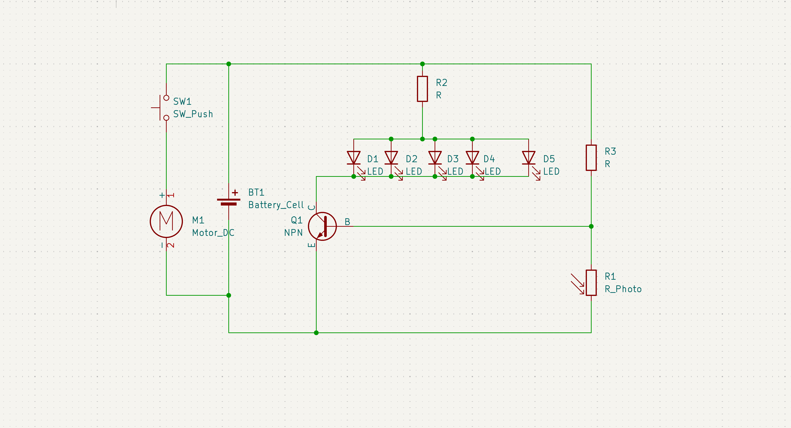
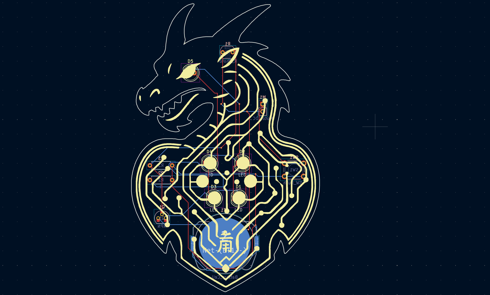
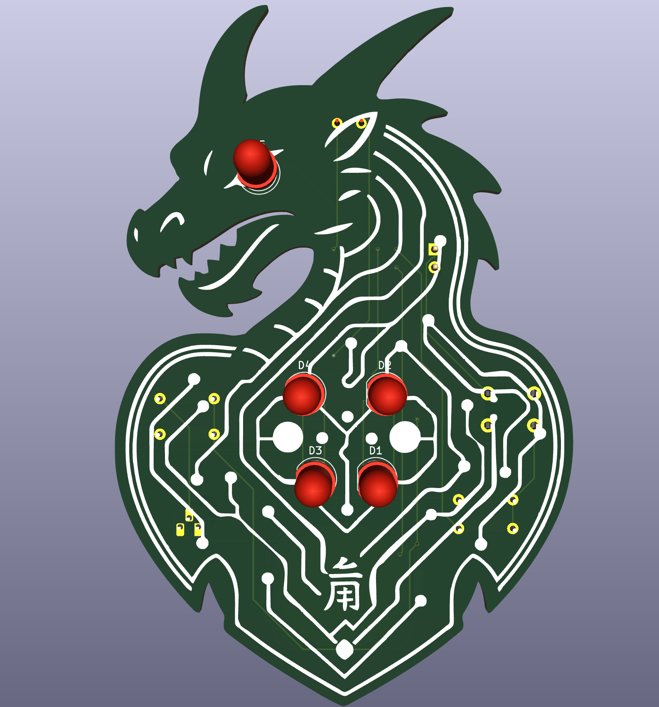
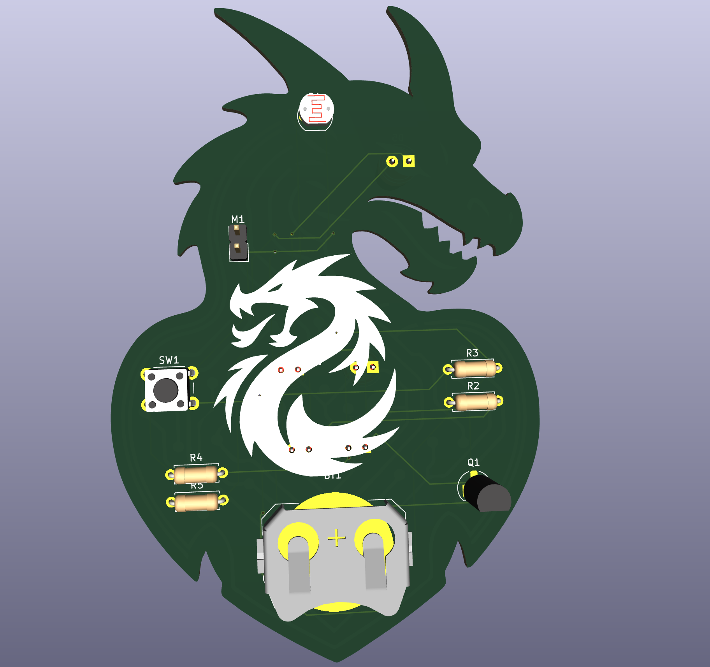

# 🐉 Dragon Pulse PCB

A creative, dragon-shaped PCB that comes alive in the dark — featuring glowing eyes and a beating heart. This project combines aesthetics with simple analog electronics to deliver a unique wearable or desktop artifact.

---

## ✨ Features

- 🫀 **Heartbeat LEDs**: 4 red LEDs light up in the dark making up its heart.
- 👁️ **Eye LED**: A single LED lights up when ambient light is low.
- ⚙️ **Growl Effect**: Press a button to trigger a small vibration motor for a "growl" effect.
- 🔋 Powered by a CR2032 coin cell — compact and portable.
- 🐉 All electronics embedded on a dragon-shaped PCB, with silkscreen art and compact layout.

---

## 📷 Project Images

### 🔌 Schematic Diagram

### 🧩 PCB Layout
  

### 🧊 3D Model

